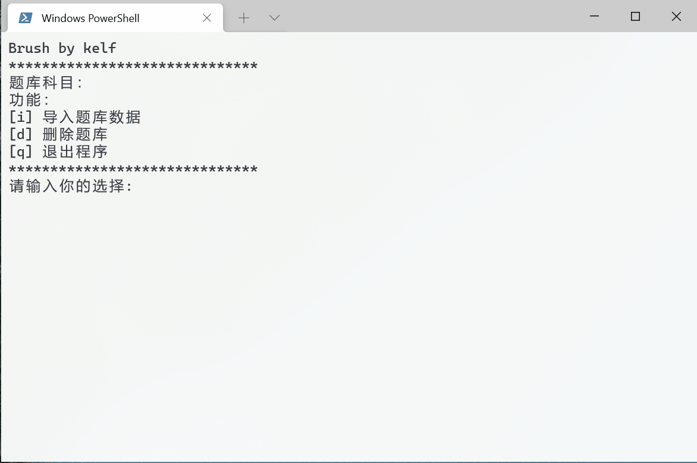

# Brush

## 简介

一款命令行环境下的刷题软件，功能：

* 支持用户自行导入json题库
* 目前软件自带的题库有<u>军事理论</u>和<u>近代史</u>
* 有错题收集和复习的功能
* 错题连续做对3次，才会从错题本中清除（类似百词斩）

注意：

* 导入题库不要乱用，在导入新题库的同时会删除之前的数据，选择导入的功能还没有加
* 有什么问题，可以提issue（临近考试，不是影响使用的大问题，应该不会改了）



---


## 使用

1. 确保安装了python3

2. 终端下切换工作目录到此项目

3. 使用下面命令

```bash
python3 Brush.py
```

***如果以上操作不会，请自己在网上检索，考试周大家都很忙的，拜托了！***

---
## 关于json导入

```json
{
    "name":"科目名称",
    "sections":{
        "章节名称(如：第0章)":{
            "problems":{
                "题目一(如:1. (单选题) 我是不是最帅的？>_<)":{
                    "key":"题目的答案（如：A）",
                    "option":"题目的选项如（A. 是的\nB. 是的\nC. 是的\nD. 是的）",
                    "type":"题的种类（如：选择题）"
                },
                "题目二":""

            }
        },
        "章节2xx":"xxx"
    }
}
```

---
## 更新日志

### 2022/01/06

* 去除了近代史题库中重复的题，现在总计1408道

* 将错题的连续做对的次数改为3次

### 2022/01/05

* 近代史题库更新 8，9，10章，至此完结

### 2022/01/04

* 做题时把 1 2 3 4 5 6 映射到了 A B C D E F

### 2022/01/03

* 军事理论判断题题库的修复

### 2021/12/31

* 增加错题顺序的打乱，现在做错题时是随机顺序了
* 错题改为做对4次才会从错题本中删除

### 2021/12/30

* 答题界面显示进度
* 修章节列表输入非正常范围数字退出程序
* 多选题现在可以不按照顺序输入答案了

### 2021/12/28

* 增加主菜单页面对科目做题进度的统计
* 完善了题目做完以后，任然停留在最后一道的BUG(包括列表的细节)
* 新增历史题库第7章

### 2021/12/28

* 重写了程序
* 增加了对军事理论的支持
* 支持json导入题库
* 完善了异常的处理

### 2021/12/25

* 修复选择题判断错误的bug
* 增加对Linux/Unix的支持

### 2021/12/24

* 刷题进度记录
* 错题收集功能
* 菜单列表下显示进度
* 清空错题记录和刷题进度记录
